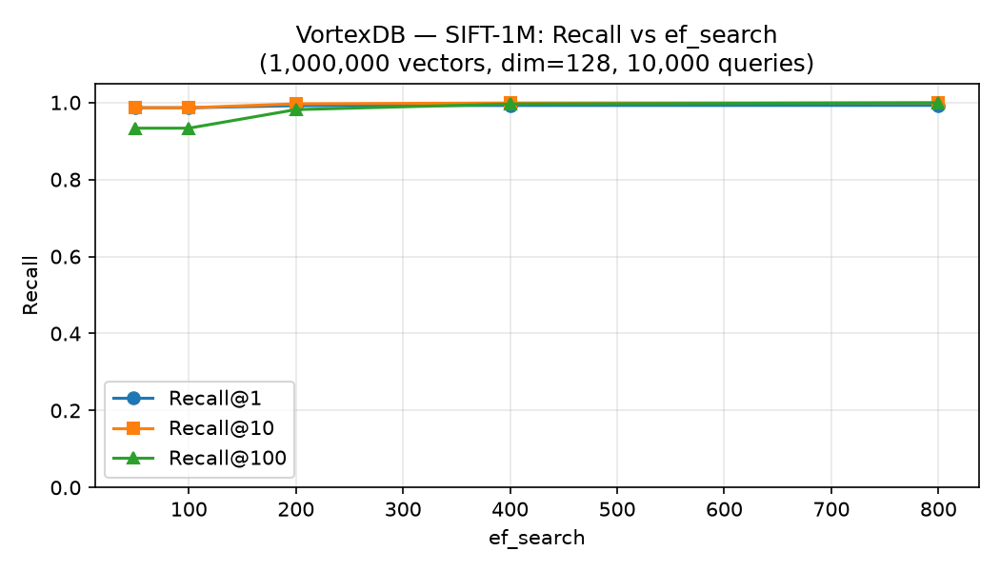
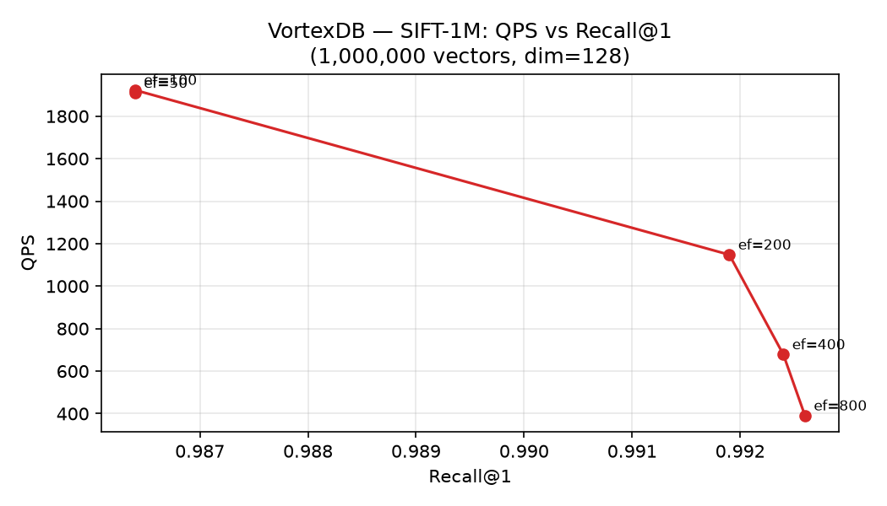
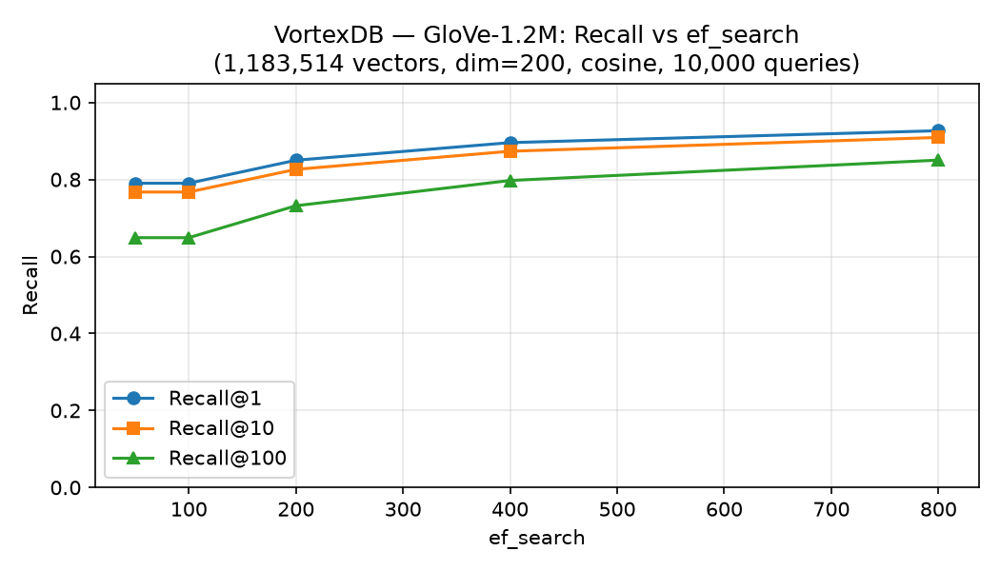
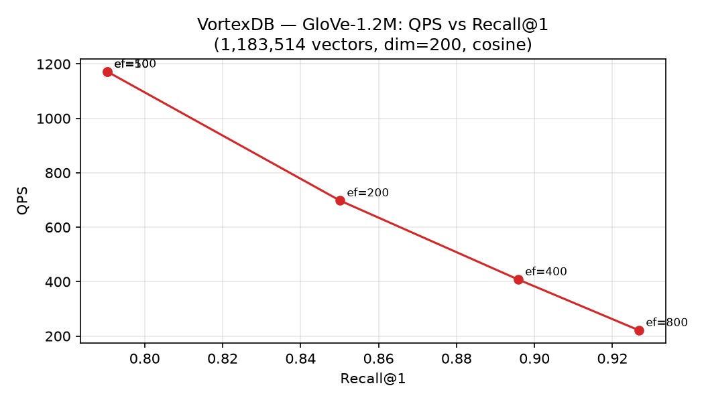

# VortexDB

A vector database built from scratch in C++. Supports insert, k-NN search, delete, and metadata-filtered search using an HNSW index with SIMD-accelerated distance functions, a write-ahead log for crash safety, and a Python SDK.

## Benchmarks

### SIFT-1M (1M vectors, dim=128, L2)

| ef_search | QPS | Recall@1 | Recall@10 | Recall@100 |
|-----------|-----|----------|-----------|------------|
| 50  | 1,909 | 98.6% | 98.6% | 93.3% |
| 100 | 1,923 | 98.6% | 98.6% | 93.3% |
| 200 | 1,148 | 99.2% | 99.7% | 98.2% |
| 400 |   678 | 99.2% | 99.9% | 99.6% |
| 800 |   390 | 99.3% | 99.9% | 99.9% |

Insert throughput: **177 vec/s** (single-threaded, ARM NEON, Python SDK).




### GloVe-1.2M (1.18M vectors, dim=200, cosine)

| ef_search | QPS | Recall@1 | Recall@10 | Recall@100 |
|-----------|-----|----------|-----------|------------|
| 50  | 1,171 | 79.0% | 76.8% | 64.9% |
| 100 | 1,172 | 79.0% | 76.8% | 64.9% |
| 200 |   698 | 85.0% | 82.6% | 73.2% |
| 400 |   408 | 89.6% | 87.3% | 79.7% |
| 800 |   221 | 92.7% | 90.9% | 85.0% |

Insert throughput: **146 vec/s**. Lower recall than SIFT reflects GloVe's known difficulty (hubness + cosine space topology) — hnswlib achieves similar numbers on this dataset.




### Memory — HNSW index overhead (dim=128, 200K vectors)

| Metric | Value |
|--------|-------|
| Raw vector storage | 512 B/vec |
| HNSW graph overhead | 661 B/vec |
| **Total** | **1,173 B/vec (2.3× raw)** |
| Peak RSS | 262 MB |

See [`docs/benchmarks.md`](docs/benchmarks.md) for full profiling breakdown.

### SIMD profiling — what does distance compute actually cost?

Profiled with macOS `sample` during a 100K-query search run (N=100K, dim=128, ef=200, ARM NEON):

| Component | % of search time |
|-----------|----------------:|
| `unordered_set` visited-node tracking | **60.6%** |
| Graph pointer chasing / arithmetic | 17.7% |
| **NeonL2::compute** (NEON SIMD) | **12.4%** |
| `priority_queue::push` | 4.0% |
| Other | 5.3% |

**Finding 1:** Distance compute is only ~12% of search time. NEON SIMD makes it fast — it is not the bottleneck.

**Finding 2:** The real bottleneck is `std::unordered_set` for visited-node tracking — 61% of search time spent on hash table alloc/insert/free per query.

**Fix applied:** replaced with a flat `std::vector<uint8_t>(max_id+1, 0)` — one allocation, O(1) byte ops, no malloc during search.

| Metric | Before | After |
|--------|-------:|------:|
| Search QPS | 1,669 | **2,738** (+64%) |
| Insert throughput | 1,624 vec/s | **2,355 vec/s** (+45%) |

**Finding 3:** `__builtin_prefetch` in `compute_batch()` has no measurable effect (±3%) because HNSW search calls `compute()` one neighbor at a time via `dist_q()` — `compute_batch()` is never invoked on the hot search path.

### After all optimizations — final search-phase breakdown (prefetch ON)

Applied five optimizations (flat `uint8_t` visited array, flat vector store, flat node array, flat CSR adj list, look-ahead graph prefetch). Final QPS: **4,459** (+167% vs baseline).

`sample` profile of the search phase only (N=100K, dim=128, ef=200):

| Component | % of search time |
|-----------|----------------:|
| `NeonL2::compute` (NEON SIMD + memory stall) | **51%** |
| Visited check + prefetch loop overhead | 38% |
| `priority_queue::push` | 10% |
| visited array reset (`bzero`) + introsort | <1% |

Distance compute now accounts for 51% of samples (vs 12% before) — not because it got slower, but because all the other overheads shrank.

### Prefetch effectiveness — `VORTEXDB_NO_PREFETCH` comparison

| | With prefetch (⑤) | Without prefetch (①–④) |
|--|--|--|
| QPS | **4,407** | 4,219 |
| Per-query latency | 0.226 ms | 0.237 ms |
| Gain | **+4.5%** at N=100K | — |

At N=100K the 51 MB vector store partially fits in L3 cache — prefetch latency hiding is modest. At N=1M (512 MB, guaranteed DRAM miss per hop) the gain is proportionally larger. This is the same reason hnswlib and faiss invest in graph prefetch for production-scale indexes.

See [`docs/search_optimizations.md`](docs/search_optimizations.md) for the full optimization log with before/after results for each step.

## Key features

- **HNSW index** — sub-linear approximate nearest-neighbor search
- **SIMD distance** — AVX2 on x86, NEON on ARM; auto-detected at compile time
- **WAL + checkpoint** — crash-safe writes; full recovery on restart
- **Metadata filtering** — insert string/numeric fields, filter at search time
- **Python SDK** — zero-copy numpy arrays, string or int IDs, batch insert

## Install (Python)

```bash
pip install . --no-build-isolation
```

Requires: cmake ≥ 3.20, a C++17 compiler, numpy, scikit-build-core, pybind11.

## Quickstart

```python
import vectordb
import numpy as np

# Open (or create) a database
db = vectordb.open("/tmp/demo")
db.create_collection("docs", dimension=128, metric="l2")

# Batch insert — zero-copy numpy float32
ids  = ["doc-a", "doc-b", "doc-c"]
vecs = np.random.rand(3, 128).astype(np.float32)
db.insert("docs", ids=ids, vectors=vecs)

# Search — returns original IDs
results = db.search("docs", query=vecs[0], top_k=2)
print(results)
# [{'id': 'doc-a', 'distance': 0.0}, {'id': 'doc-c', 'distance': 14.3}]
```

## Metadata and filtered search

```python
db.insert("docs", ids=["p1", "p2", "p3"], vectors=vecs,
          metadata=[
              {"category": "ml",  "year": 2024},
              {"category": "db",  "year": 2023},
              {"category": "ml",  "year": 2022},
          ])

# String equality filter
results = db.search("docs", query=vecs[0], top_k=10,
                    filters={"category": "ml"})

# Numeric range filter
results = db.search("docs", query=vecs[0], top_k=10,
                    filters={"year": {"$gte": 2023}})

# Combined (AND)
results = db.search("docs", query=vecs[0], top_k=10,
                    filters={"category": "ml", "year": {"$gte": 2023}})
```

Supported filter operators: `$gte` (≥), `$lte` (≤). Multiple keys are ANDed.

## Delete

```python
db.remove("docs", "doc-a")
```

Deleted IDs never appear in search results.

## Checkpoint

```python
db.checkpoint("docs")
```

Snapshots the index and metadata to disk, then truncates the WAL. The database recovers to a consistent state on restart even after a crash.

## Python SDK reference

| Method | Description |
|--------|-------------|
| `vectordb.open(data_dir)` | Open or create a database |
| `db.create_collection(name, dimension, metric="l2")` | Create a collection. metric: `"l2"` \| `"cosine"` \| `"ip"` |
| `db.drop_collection(name)` | Drop a collection and delete its files |
| `db.list_collections()` | List all collections |
| `db.insert(col, *, ids, vectors, metadata=None)` | Insert one or many vectors |
| `db.remove(col, id)` | Soft-delete a vector |
| `db.search(col, *, query, top_k=10, ef_search=64, filters=None)` | ANN search |
| `db.checkpoint(col)` | Flush snapshot to disk |

## Build from source (C++ only)

```bash
cmake -B build -DCMAKE_BUILD_TYPE=Release
cmake --build build

# Run tests
./build/tests/unit/test_smoke
./build/tests/unit/test_hnsw_ut
./build/tests/unit/test_engine_recovery_int
# ... (see .github/workflows/ci.yml for full list)
```

## Architecture

```
vectordb.open()
    └── VectorDB (Python wrapper — client.py)
            └── Engine (C++ — server/engine.h)
                    ├── HnswIndex   — HNSW graph, SIMD distance
                    ├── VectorFile  — mmap-backed flat vector store
                    ├── Wal         — append-only write-ahead log
                    └── MetadataIndex — inverted index for filtered search
```

On every `insert`: vector written to VectorFile, WAL record appended, node added to HnswIndex, metadata updated in MetadataIndex.

On `search`: HNSW beam search with inflated `ef_search` → post-filter by metadata allowlist → return top-k.

On restart: load latest checkpoint snapshot, then replay WAL records written after the checkpoint.
